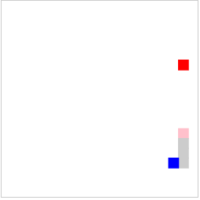

# AStar-Snake
基于A*算法+canvas+BST的自动寻路贪吃蛇-----JS版，目前还没实现吃满算法

游戏领域，寻路算法是一个老生常谈的问题，常见的DFS、BFS、A*、Dijkstra等等还有其它博主未知的算法，而贪吃蛇是一个很好的学习寻路算法的项目。

很久之前就用JS写过A*自动寻路的贪吃蛇，不过就算直到目前为止还是没有写出吃满算法, 最近在补数据结构算法的知识，现学现用，算是重构之前的实现。

此BST非平衡BST。

#  2020-05-06更新
目前基本实现吃满，但是很费时间，走S形估计可以很快，不过下图算法又不像完全走S, 总之达不到下图俄罗斯大佬的优秀。
暂时不折腾了，改日再会。


# 效果图
旧版本地址：[v1版本](https://github.com/cdoer/AStar-Snake/tree/v1)


# 效果图2



# 运行方法
```
npm install
npm run start
```

# 配置参数
```
let defaultOps = {
    debug:true,//是否开启日志，控制台打印运行状态
    style:"margin:0 auto;background:#fff;display: block;",//画布样式
    headColor:"pink",//头颜色
    bodyColor:"#ccc",//身体颜色
    foodColor:"red",//食物颜色
    tailColor:"blue",//尾巴颜色
    xSize:20,//矩阵长
    ySize:20,//矩阵宽
    unitSize:10,//单元格大小
    border:"1px solid #ccc"//画布边框
}
```
