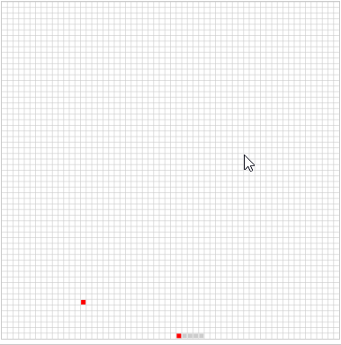

# AStar-Snake
基于A*算法+canvas+BST的自动寻路贪吃蛇-----JS版，目前还没实现吃满算法

游戏领域，寻路算法是一个老生常谈的问题，常见的DFS、BFS、A*、Dijkstra等等还有其它博主未知的算法，而贪吃蛇是一个很好的学习寻路算法的项目。

很久之前就用JS写过A*自动寻路的贪吃蛇，不过就算直到目前为止还是没有写出吃满算法, 最近在补数据结构算法的知识，现学现用，算是重构之前的实现。

此BST非平衡BST。

# 效果图



# 运行方法
```
npm install
npm run start
```

# 配置参数
```
let defaultOps = {
    style:"margin:0 auto;background:#fff;display: block;",//画布样式
    headColor:"red",//头颜色
    bodyColor:"#ccc",//身体颜色
    foodColor:"red",//食物颜色
    xSize:60,//矩阵长
    ySize:60,//矩阵宽
    unitSize:10,//单元格大小
    border:"1px solid #ccc"//画布边框
}
```
